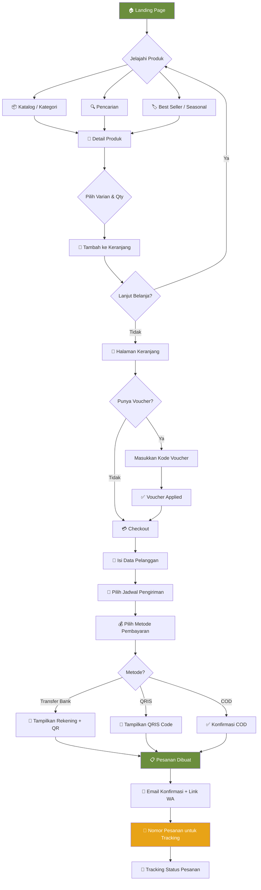
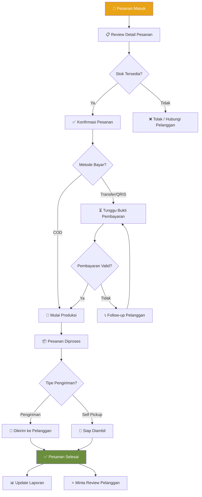
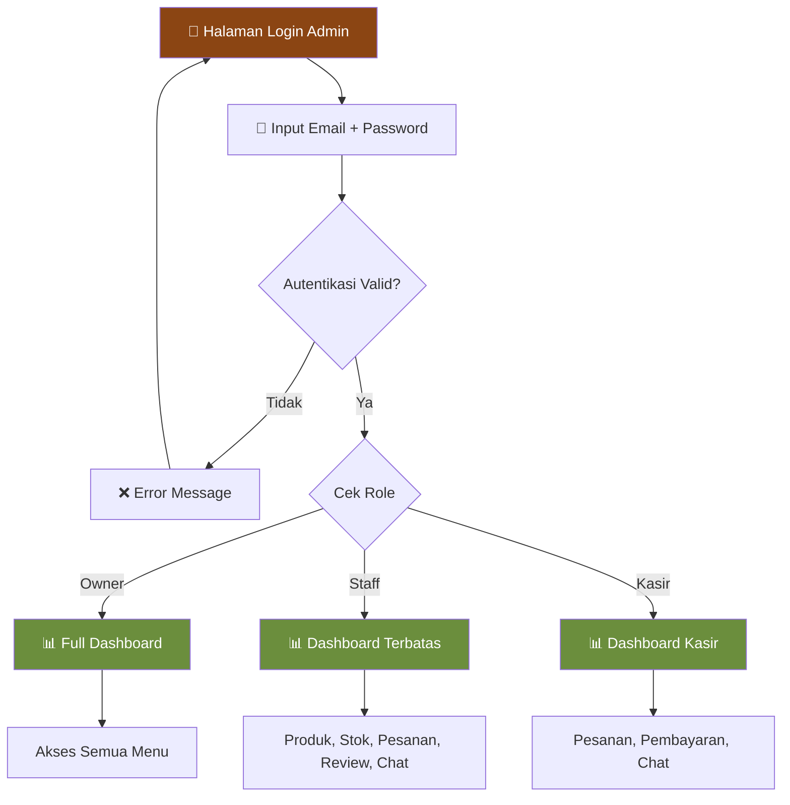
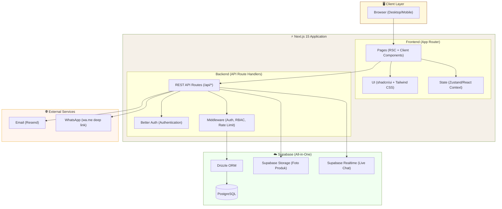
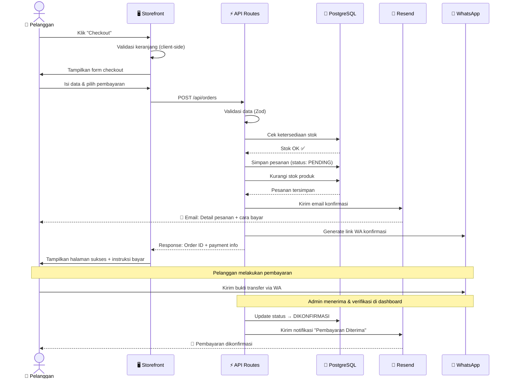
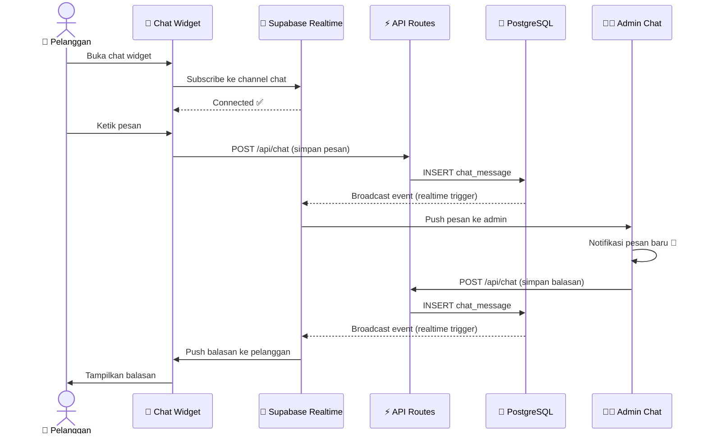
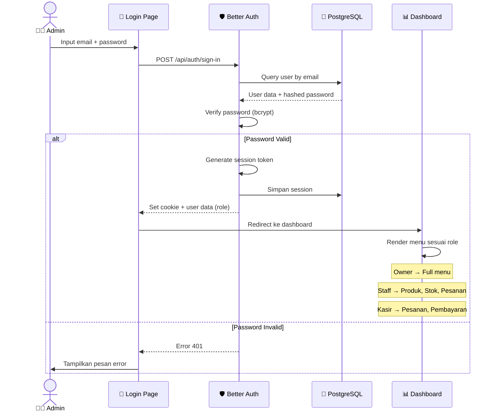
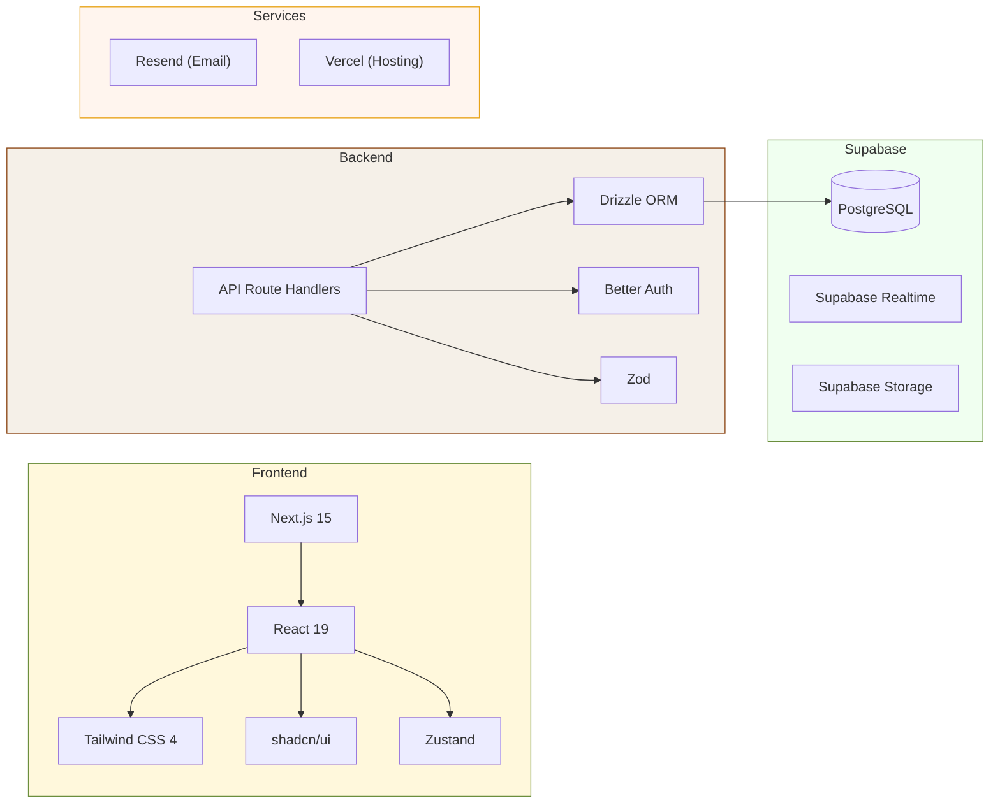

# 🧁 PRD — Dapoer Ajung Cookies & Bakery

> **Product Requirements Document**
> Versi: 1.1 · Tanggal: 11 April 2026 · Status: ✅ Disetujui

---

## Daftar Isi

1. [Overview](#1-overview)
2. [Requirements](#2-requirements)
3. [Core Features](#3-core-features)
4. [User Flow](#4-user-flow)
5. [Architecture](#5-architecture)
6. [Sequence Diagram](#6-sequence-diagram)
7. [Database Schema](#7-database-schema)
8. [Design & Technical Constraints](#8-design--technical-constraints)
9. [Tech Stack](#9-tech-stack)

---

## 1. Overview

### 1.1 Latar Belakang

**Dapoer Ajung Cookies & Bakery** adalah usaha rumahan yang telah berdiri sejak tahun 1990, berlokasi di Kota Gorontalo. Bisnis ini menyajikan kue basah modern, kue khas tradisional Gorontalo, kue kering toples untuk momen Lebaran/Natal, serta hampers. Selama 36 tahun beroperasi, Dapoer Ajung baru mengandalkan pemesanan via WhatsApp dan mulut-ke-mulut. Dengan meningkatnya permintaan — termasuk kebutuhan bekal MBG untuk anak sekolah dan hampers korporat — dibutuhkan platform digital yang mampu menjangkau pasar lebih luas di area Gorontalo dan sekitarnya.

### 1.2 Visi Produk

Membangun platform e-commerce yang **warm, cozy, dan personal** — mencerminkan karakter rumahan Dapoer Ajung — sekaligus memberikan pengalaman belanja online yang modern, mudah, dan terpercaya bagi pelanggan di Kota Gorontalo dan sekitarnya.

### 1.3 Tujuan Bisnis

| Tujuan | KPI Target (6 bulan pertama) |
|---|---|
| Digitalisasi pemesanan | 70% pesanan melalui website |
| Peningkatan order harian | Minimal 100 pcs/hari |
| Ekspansi jangkauan pasar | Cakupan seluruh Kota Gorontalo & sekitarnya |
| Peningkatan efisiensi operasional | Pengurangan 50% waktu pengelolaan pesanan manual |
| Brand awareness online | 1.000+ unique visitors/bulan |

### 1.4 Target Audiens

| Segmen | Deskripsi | Kebutuhan Utama |
|---|---|---|
| 🏠 Ibu Rumah Tangga | Pembeli reguler kue harian & kue tradisional | Kemudahan pesan, pilihan variatif, harga terjangkau |
| 👩‍💼 Pekerja Korporat | Pesanan hampers kantor, acara bisnis, meeting | Pemesanan bulk, invoice, jadwal pengiriman |
| 🎓 Anak Muda | Kue untuk acara, hadiah, nongkrong | Tampilan trendy, promo, kemudahan checkout |
| 🏫 Program MBG | Bekal makan siang anak sekolah | Volume besar, konsistensi, harga paket |
| 🎉 Event Organizer | Pesanan untuk hajatan, pernikahan, acara besar | Custom order, pre-order, komunikasi langsung |

### 1.5 Cakupan MVP

> [!IMPORTANT]
> Dokumen ini mendeskripsikan **MVP (Minimum Viable Product)** yang ditargetkan launch paling lambat **Oktober 2026**.

**Termasuk dalam MVP:**
- Storefront pelanggan (katalog, keranjang, checkout tanpa akun)
- Admin dashboard multi-role (owner, staff, kasir)
- Manajemen pesanan & stok
- Pembayaran manual (transfer bank, QRIS, COD)
- Integrasi WhatsApp
- Live chat sederhana
- Notifikasi email dasar
- Review/rating produk
- Sistem promo/voucher dasar

**Ditunda untuk versi selanjutnya (v2):**
- Payment gateway otomatis (Midtrans/Xendit)
- Push notification (PWA/Firebase)
- Program loyalitas/membership
- Multi-bahasa (Internasionalisasi)
- Integrasi sosial media login
- Laporan analytics lanjutan (export PDF/Excel)
- Fitur MBG khusus (kontrak bulanan sekolah)

---

## 2. Requirements

### 2.1 Functional Requirements

#### FR-01: Katalog Produk
| ID | Requirement | Prioritas |
|---|---|---|
| FR-01.1 | Menampilkan produk dengan foto, nama, deskripsi, harga, dan status ketersediaan | **P0** |
| FR-01.2 | Kategori produk: Kue Basah, Kue Kering, Hampers, Paket Hemat | **P0** |
| FR-01.3 | Label khusus: Best Seller, Seasonal (Lebaran/Natal), New Arrival | **P0** |
| FR-01.4 | Varian produk (ukuran, rasa) dengan harga berbeda | **P0** |
| FR-01.5 | Pencarian produk dengan filter kategori, harga, dan ketersediaan | **P1** |
| FR-01.6 | Tampilan produk responsif (grid/list view) | **P1** |

#### FR-02: Keranjang & Checkout
| ID | Requirement | Prioritas |
|---|---|---|
| FR-02.1 | Tambah/hapus/ubah jumlah item di keranjang | **P0** |
| FR-02.2 | Checkout sebagai guest (tanpa registrasi) | **P0** |
| FR-02.3 | Form checkout: nama, nomor telepon, alamat, catatan pesanan | **P0** |
| FR-02.4 | Pilih metode pembayaran (Transfer Bank, QRIS, COD) | **P0** |
| FR-02.5 | Pilih jadwal pengiriman/pengambilan (tanggal & waktu) | **P0** |
| FR-02.6 | Aplikasi kode voucher/promo | **P1** |
| FR-02.7 | Ringkasan pesanan sebelum konfirmasi | **P0** |

#### FR-03: Manajemen Pesanan (Admin)
| ID | Requirement | Prioritas |
|---|---|---|
| FR-03.1 | Dashboard daftar pesanan dengan status (Pending → Dikonfirmasi → Diproses → Dikirim → Selesai) | **P0** |
| FR-03.2 | Update status pesanan secara real-time | **P0** |
| FR-03.3 | Detail pesanan lengkap (item, pelanggan, alamat, pembayaran) | **P0** |
| FR-03.4 | Filter & pencarian pesanan (status, tanggal, pelanggan) | **P1** |
| FR-03.5 | Notifikasi otomatis ke pelanggan saat status berubah | **P1** |

#### FR-04: Manajemen Produk (Admin)
| ID | Requirement | Prioritas |
|---|---|---|
| FR-04.1 | CRUD produk (tambah, edit, hapus, arsip) | **P0** |
| FR-04.2 | Upload multi-foto produk | **P0** |
| FR-04.3 | Manajemen kategori & sub-kategori | **P0** |
| FR-04.4 | Manajemen varian (ukuran, rasa, harga) | **P0** |
| FR-04.5 | Toggle ketersediaan produk (available/sold out) | **P0** |
| FR-04.6 | Manajemen label produk (best seller, seasonal, dll) | **P1** |

#### FR-05: Manajemen Stok
| ID | Requirement | Prioritas |
|---|---|---|
| FR-05.1 | Tracking stok produk jadi | **P0** |
| FR-05.2 | Notifikasi stok rendah | **P1** |
| FR-05.3 | Riwayat perubahan stok (stock movement log) | **P1** |
| FR-05.4 | Stok otomatis berkurang saat pesanan dikonfirmasi | **P0** |

#### FR-06: Review & Rating
| ID | Requirement | Prioritas |
|---|---|---|
| FR-06.1 | Pelanggan dapat memberikan rating (1-5 bintang) dan review teks | **P1** |
| FR-06.2 | Review muncul di halaman produk | **P1** |
| FR-06.3 | Admin dapat mengelola/moderasi review | **P1** |
| FR-06.4 | Rating rata-rata ditampilkan di card produk | **P1** |

#### FR-07: Promo, Diskon & Voucher
| ID | Requirement | Prioritas |
|---|---|---|
| FR-07.1 | Buat voucher dengan kode unik (persentase/nominal) | **P1** |
| FR-07.2 | Banner promo di homepage | **P0** |
| FR-07.3 | Diskon per produk/kategori | **P1** |
| FR-07.4 | Batas waktu dan jumlah penggunaan voucher | **P1** |

#### FR-08: Komunikasi & Notifikasi
| ID | Requirement | Prioritas |
|---|---|---|
| FR-08.1 | Integrasi WhatsApp (tombol langsung ke WA admin) | **P0** |
| FR-08.2 | Live chat dalam aplikasi (pelanggan ↔ admin/kasir) | **P1** |
| FR-08.3 | Notifikasi email konfirmasi pesanan & status update | **P1** |
| FR-08.4 | Notifikasi WhatsApp otomatis untuk status pesanan | **P2** |
| FR-08.5 | Push notification browser | **P2** |

#### FR-09: Laporan & Analytics (Admin)
| ID | Requirement | Prioritas |
|---|---|---|
| FR-09.1 | Dashboard ringkasan: total pesanan, pendapatan, produk terlaris hari ini | **P0** |
| FR-09.2 | Laporan penjualan harian, mingguan, bulanan | **P1** |
| FR-09.3 | Laporan per produk (jumlah terjual, pendapatan) | **P1** |
| FR-09.4 | Grafik tren penjualan | **P1** |

#### FR-10: Autentikasi & Otorisasi (Admin)
| ID | Requirement | Prioritas |
|---|---|---|
| FR-10.1 | Login admin (email + password) | **P0** |
| FR-10.2 | Role-based access control: Owner, Staff, Kasir | **P0** |
| FR-10.3 | Owner: full access semua fitur | **P0** |
| FR-10.4 | Staff: manajemen produk, stok, pesanan | **P0** |
| FR-10.5 | Kasir: konfirmasi pesanan, update status pembayaran | **P0** |

### 2.2 Non-Functional Requirements

| ID | Requirement | Target |
|---|---|---|
| NFR-01 | **Performance**: Halaman utama load < 3 detik (LCP) | P0 |
| NFR-02 | **Responsiveness**: Tampilan optimal mobile, tablet, desktop | P0 |
| NFR-03 | **Accessibility**: WCAG 2.1 Level AA compliance | P1 |
| NFR-04 | **SEO**: Core Web Vitals passing, meta tags, sitemap | P0 |
| NFR-05 | **Security**: HTTPS, input sanitization, CSRF protection | P0 |
| NFR-06 | **Availability**: 99.5% uptime | P1 |
| NFR-07 | **Scalability**: Mampu handle 100+ concurrent users | P1 |
| NFR-08 | **Browser Support**: Chrome, Firefox, Safari, Edge (2 versi terakhir) | P0 |

---

## 3. Core Features

### 3.1 Storefront (Pelanggan)

```
┌─────────────────────────────────────────────────────┐
│                  STOREFRONT FEATURES                │
├─────────────────────────────────────────────────────┤
│                                                     │
│  🏠 Homepage                                        │
│  ├── Hero banner carousel (promo & seasonal)        │
│  ├── Kategori produk (icon cards)                   │
│  ├── Produk best seller                             │
│  ├── Produk seasonal/terbaru                        │
│  ├── Tentang Dapoer Ajung (story section)           │
│  ├── Testimoni pelanggan                            │
│  └── CTA WhatsApp floating button                   │
│                                                     │
│  📦 Katalog Produk                                  │
│  ├── Grid produk dengan filter & sort               │
│  ├── Sidebar kategori                               │
│  ├── Search bar                                     │
│  └── Pagination/infinite scroll                     │
│                                                     │
│  🔍 Detail Produk                                   │
│  ├── Gallery foto (multi-image)                     │
│  ├── Nama, deskripsi, harga                         │
│  ├── Pilihan varian (ukuran/rasa)                   │
│  ├── Quantity selector                              │
│  ├── Tombol "Tambah ke Keranjang"                   │
│  ├── Review & rating pelanggan                      │
│  └── Produk terkait/rekomendasi                     │
│                                                     │
│  🛒 Keranjang Belanja                               │
│  ├── Daftar item (edit qty, hapus)                  │
│  ├── Input kode voucher                             │
│  ├── Subtotal & total                               │
│  └── Tombol "Lanjut ke Checkout"                    │
│                                                     │
│  💳 Checkout (Guest)                                │
│  ├── Form data pelanggan                            │
│  ├── Pilih metode pengiriman                        │
│  ├── Pilih jadwal pengiriman/pickup                 │
│  ├── Pilih metode pembayaran                        │
│  ├── Ringkasan pesanan                              │
│  └── Konfirmasi pesanan                             │
│                                                     │
│  📋 Tracking Pesanan                                │
│  ├── Input nomor pesanan                            │
│  ├── Status tracking visual                         │
│  └── Detail pesanan                                 │
│                                                     │
│  💬 Live Chat Widget                                │
│  ├── Chat bubble di sudut kanan bawah               │
│  ├── Real-time messaging                            │
│  └── Riwayat chat per sesi                          │
│                                                     │
│  📄 Halaman Statis                                  │
│  ├── Tentang Kami                                   │
│  ├── FAQ                                            │
│  ├── Syarat & Ketentuan                             │
│  └── Kebijakan Privasi                              │
│                                                     │
└─────────────────────────────────────────────────────┘
```

### 3.2 Admin Dashboard

```
┌─────────────────────────────────────────────────────┐
│                ADMIN DASHBOARD FEATURES              │
├─────────────────────────────────────────────────────┤
│                                                     │
│  📊 Dashboard Overview                              │
│  ├── Total pesanan hari ini                         │
│  ├── Pendapatan hari ini                            │
│  ├── Pesanan pending (butuh aksi)                   │
│  ├── Produk terlaris                                │
│  ├── Grafik penjualan (7/30 hari)                   │
│  └── Stok rendah alert                              │
│                                                     │
│  📦 Manajemen Pesanan                               │
│  ├── Tabel pesanan (filter, search, sort)           │
│  ├── Detail pesanan                                 │
│  ├── Update status pesanan                          │
│  ├── Konfirmasi pembayaran                          │
│  └── Cetak invoice/struk                            │
│                                                     │
│  🧁 Manajemen Produk                                │
│  ├── Daftar produk (tabel)                          │
│  ├── Tambah/edit/hapus produk                       │
│  ├── Upload foto produk                             │
│  ├── Manajemen varian                               │
│  └── Manajemen kategori                             │
│                                                     │
│  📦 Manajemen Stok                                  │
│  ├── Overview stok semua produk                     │
│  ├── Update stok manual/batch                       │
│  ├── Riwayat perubahan stok                         │
│  └── Alert stok rendah                              │
│                                                     │
│  🏷️ Promo & Voucher                                │
│  ├── Buat/edit/hapus voucher                        │
│  ├── Set diskon per produk/kategori                 │
│  ├── Manajemen banner promo                         │
│  └── Riwayat penggunaan voucher                     │
│                                                     │
│  ⭐ Manajemen Review                                │
│  ├── Moderasi review pelanggan                      │
│  ├── Approve/reject/delete review                   │
│  └── Statistik rating                               │
│                                                     │
│  💬 Live Chat (Admin Side)                          │
│  ├── Inbox chat masuk                               │
│  ├── Real-time response                             │
│  ├── Assign ke staff/kasir                          │
│  └── Riwayat percakapan                             │
│                                                     │
│  📈 Laporan & Analytics                             │
│  ├── Laporan penjualan (harian/mingguan/bulanan)    │
│  ├── Laporan per produk                             │
│  ├── Grafik tren                                    │
│  └── Summary cards (KPI)                            │
│                                                     │
│  👥 Manajemen User (Owner Only)                     │
│  ├── Tambah/edit/hapus staff & kasir                │
│  ├── Assign role & permission                       │
│  └── Log aktivitas user                             │
│                                                     │
│  ⚙️ Pengaturan                                      │
│  ├── Profil toko (nama, alamat, kontak)             │
│  ├── Jam operasional                                │
│  ├── Area pengiriman & biaya                        │
│  ├── Template pesan WhatsApp/Email                  │
│  └── Informasi rekening bank & QRIS                 │
│                                                     │
└─────────────────────────────────────────────────────┘
```

### 3.3 Matriks Akses Role

| Fitur | Owner | Staff | Kasir |
|---|:---:|:---:|:---:|
| Dashboard Overview | ✅ | ✅ (terbatas) | ✅ (terbatas) |
| Manajemen Pesanan | ✅ | ✅ | ✅ |
| Konfirmasi Pembayaran | ✅ | ❌ | ✅ |
| Manajemen Produk | ✅ | ✅ | ❌ |
| Manajemen Stok | ✅ | ✅ | ❌ |
| Promo & Voucher | ✅ | ❌ | ❌ |
| Manajemen Review | ✅ | ✅ | ❌ |
| Live Chat | ✅ | ✅ | ✅ |
| Laporan & Analytics | ✅ | ✅ (view only) | ❌ |
| Manajemen User | ✅ | ❌ | ❌ |
| Pengaturan Toko | ✅ | ❌ | ❌ |

---

## 4. User Flow

### 4.1 Flow Pelanggan — Pemesanan Produk



### 4.2 Flow Admin — Proses Pesanan



### 4.3 Flow Admin — Login & Akses Dashboard



---

## 5. Architecture

### 5.1 High-Level Architecture



### 5.2 Struktur Folder Proyek

```
dapoer_ajung_bakery/
├── src/
│   ├── app/                          # Next.js App Router
│   │   ├── (storefront)/             # Route group: halaman pelanggan
│   │   │   ├── page.tsx              # Homepage
│   │   │   ├── products/
│   │   │   │   ├── page.tsx          # Katalog produk
│   │   │   │   └── [slug]/
│   │   │   │       └── page.tsx      # Detail produk
│   │   │   ├── cart/
│   │   │   │   └── page.tsx          # Keranjang belanja
│   │   │   ├── checkout/
│   │   │   │   └── page.tsx          # Halaman checkout
│   │   │   ├── order/
│   │   │   │   └── [id]/
│   │   │   │       └── page.tsx      # Tracking pesanan
│   │   │   ├── about/
│   │   │   │   └── page.tsx          # Tentang Kami
│   │   │   └── layout.tsx            # Layout storefront
│   │   │
│   │   ├── (admin)/                  # Route group: admin dashboard
│   │   │   ├── admin/
│   │   │   │   ├── page.tsx          # Dashboard overview
│   │   │   │   ├── orders/
│   │   │   │   │   ├── page.tsx      # Daftar pesanan
│   │   │   │   │   └── [id]/
│   │   │   │   │       └── page.tsx  # Detail pesanan
│   │   │   │   ├── products/
│   │   │   │   │   ├── page.tsx      # Daftar produk
│   │   │   │   │   ├── new/
│   │   │   │   │   │   └── page.tsx  # Tambah produk
│   │   │   │   │   └── [id]/
│   │   │   │   │       └── page.tsx  # Edit produk
│   │   │   │   ├── stock/
│   │   │   │   │   └── page.tsx      # Manajemen stok
│   │   │   │   ├── promos/
│   │   │   │   │   └── page.tsx      # Promo & voucher
│   │   │   │   ├── reviews/
│   │   │   │   │   └── page.tsx      # Manajemen review
│   │   │   │   ├── chat/
│   │   │   │   │   └── page.tsx      # Live chat admin
│   │   │   │   ├── reports/
│   │   │   │   │   └── page.tsx      # Laporan & analytics
│   │   │   │   ├── users/
│   │   │   │   │   └── page.tsx      # Manajemen user (owner)
│   │   │   │   └── settings/
│   │   │   │       └── page.tsx      # Pengaturan toko
│   │   │   └── layout.tsx            # Layout admin
│   │   │
│   │   ├── (auth)/                   # Route group: authentication
│   │   │   ├── login/
│   │   │   │   └── page.tsx
│   │   │   └── layout.tsx
│   │   │
│   │   ├── api/                      # API Route Handlers
│   │   │   ├── auth/
│   │   │   │   └── [...all]/
│   │   │   │       └── route.ts      # Better Auth catch-all
│   │   │   ├── products/
│   │   │   │   └── route.ts          # CRUD produk
│   │   │   ├── categories/
│   │   │   │   └── route.ts          # CRUD kategori
│   │   │   ├── orders/
│   │   │   │   └── route.ts          # CRUD pesanan
│   │   │   ├── reviews/
│   │   │   │   └── route.ts          # CRUD review
│   │   │   ├── promos/
│   │   │   │   └── route.ts          # CRUD promo/voucher
│   │   │   ├── stock/
│   │   │   │   └── route.ts          # Manajemen stok
│   │   │   ├── chat/
│   │   │   │   └── route.ts          # Live chat API
│   │   │   ├── reports/
│   │   │   │   └── route.ts          # Data laporan
│   │   │   ├── upload/
│   │   │   │   └── route.ts          # Upload file
│   │   │   └── notifications/
│   │   │       └── route.ts          # Notifikasi
│   │   │
│   │   ├── layout.tsx                # Root layout
│   │   └── globals.css               # Global styles
│   │
│   ├── components/                   # Shared components
│   │   ├── ui/                       # shadcn/ui components
│   │   ├── storefront/               # Storefront-specific components
│   │   │   ├── header.tsx
│   │   │   ├── footer.tsx
│   │   │   ├── product-card.tsx
│   │   │   ├── cart-sheet.tsx
│   │   │   ├── hero-carousel.tsx
│   │   │   ├── category-grid.tsx
│   │   │   ├── testimonial-section.tsx
│   │   │   ├── whatsapp-fab.tsx
│   │   │   └── live-chat-widget.tsx
│   │   └── admin/                    # Admin-specific components
│   │       ├── sidebar.tsx
│   │       ├── topbar.tsx
│   │       ├── data-table.tsx
│   │       ├── stats-card.tsx
│   │       ├── chart-card.tsx
│   │       └── chat-inbox.tsx
│   │
│   ├── lib/                          # Utilities & configurations
│   │   ├── db/
│   │   │   ├── index.ts              # Drizzle client
│   │   │   ├── schema.ts             # Drizzle schema
│   │   │   └── migrations/           # Database migrations
│   │   ├── supabase/
│   │   │   ├── client.ts             # Supabase browser client
│   │   │   ├── server.ts             # Supabase server client
│   │   │   └── storage.ts            # Storage helper functions
│   │   ├── auth.ts                   # Better Auth config
│   │   ├── auth-client.ts            # Better Auth client
│   │   ├── utils.ts                  # Helper functions
│   │   ├── validators.ts             # Zod schemas
│   │   └── constants.ts              # App constants
│   │
│   ├── hooks/                        # Custom React hooks
│   │   ├── use-cart.ts
│   │   ├── use-chat.ts
│   │   └── use-auth.ts
│   │
│   └── types/                        # TypeScript types
│       └── index.ts
│
├── public/                           # Static assets
│   ├── images/
│   └── icons/
│
├── drizzle.config.ts                 # Drizzle config
├── next.config.ts                    # Next.js config
├── tailwind.config.ts                # Tailwind config
├── tsconfig.json                     # TypeScript config
├── package.json
└── .env.local                        # Environment variables
```

---

## 6. Sequence Diagram

### 6.1 Checkout & Pemesanan



### 6.2 Live Chat



### 6.3 Admin Login & RBAC



---

## 7. Database Schema

### 7.1 Entity Relationship Diagram

```mermaid
erDiagram
    USERS {
        uuid id PK
        varchar email UK
        varchar name
        varchar hashed_password
        enum role "OWNER | STAFF | CASHIER"
        boolean is_active
        timestamp created_at
        timestamp updated_at
    }

    SESSIONS {
        uuid id PK
        uuid user_id FK
        varchar token UK
        timestamp expires_at
        timestamp created_at
    }

    CATEGORIES {
        uuid id PK
        varchar name UK
        varchar slug UK
        text description
        varchar image_url
        integer sort_order
        boolean is_active
        timestamp created_at
        timestamp updated_at
    }

    PRODUCTS {
        uuid id PK
        uuid category_id FK
        varchar name
        varchar slug UK
        text description
        text short_description
        integer base_price "harga dasar dalam rupiah"
        integer discount_price "nullable, harga diskon"
        varchar[] images "array URL gambar"
        enum status "ACTIVE | DRAFT | ARCHIVED"
        boolean is_best_seller
        boolean is_seasonal
        varchar seasonal_tag "nullable: LEBARAN | NATAL | etc"
        integer stock_quantity
        integer min_order_quantity
        float avg_rating
        integer review_count
        timestamp created_at
        timestamp updated_at
    }

    PRODUCT_VARIANTS {
        uuid id PK
        uuid product_id FK
        varchar name "e.g., Ukuran Besar"
        varchar type "SIZE | FLAVOR | CUSTOM"
        integer price "harga varian"
        integer stock_quantity
        boolean is_available
        timestamp created_at
    }

    PRODUCT_LABELS {
        uuid id PK
        uuid product_id FK
        varchar label_name "BEST_SELLER | NEW | SEASONAL | PROMO"
        timestamp start_date
        timestamp end_date
    }

    ORDERS {
        uuid id PK
        varchar order_number UK "DAB-20260411-001"
        varchar customer_name
        varchar customer_phone
        varchar customer_email "nullable"
        text delivery_address
        text notes "nullable, catatan khusus"
        enum delivery_method "DELIVERY | PICKUP"
        timestamp delivery_date
        varchar delivery_time_slot "e.g., 09:00-12:00"
        enum payment_method "TRANSFER | QRIS | COD"
        enum payment_status "UNPAID | PAID | VERIFIED | REFUNDED"
        enum order_status "PENDING | CONFIRMED | PROCESSING | READY | SHIPPED | COMPLETED | CANCELLED"
        integer subtotal
        integer discount_amount
        integer delivery_fee
        integer total_amount
        varchar voucher_code "nullable"
        uuid confirmed_by FK "nullable, user_id admin"
        timestamp created_at
        timestamp updated_at
    }

    ORDER_ITEMS {
        uuid id PK
        uuid order_id FK
        uuid product_id FK
        uuid variant_id FK "nullable"
        varchar product_name "snapshot nama produk"
        varchar variant_name "snapshot nama varian"
        integer unit_price "snapshot harga saat pesan"
        integer quantity
        integer subtotal
        text notes "nullable, catatan per item"
    }

    REVIEWS {
        uuid id PK
        uuid product_id FK
        uuid order_id FK "nullable"
        varchar reviewer_name
        varchar reviewer_email "nullable"
        integer rating "1-5"
        text comment
        enum status "PENDING | APPROVED | REJECTED"
        uuid moderated_by FK "nullable"
        timestamp created_at
    }

    VOUCHERS {
        uuid id PK
        varchar code UK
        text description
        enum type "PERCENTAGE | FIXED_AMOUNT"
        integer value "persentase atau nominal"
        integer min_order_amount "minimum pesanan"
        integer max_discount_amount "nullable, max potongan utk persen"
        integer usage_limit "nullable, batas penggunaan"
        integer usage_count
        timestamp start_date
        timestamp end_date
        boolean is_active
        timestamp created_at
    }

    PROMO_BANNERS {
        uuid id PK
        varchar title
        text description
        varchar image_url
        varchar link_url "nullable"
        integer sort_order
        boolean is_active
        timestamp start_date
        timestamp end_date
        timestamp created_at
    }

    CHAT_CONVERSATIONS {
        uuid id PK
        varchar customer_session_id
        varchar customer_name
        uuid assigned_to FK "nullable, user_id admin"
        enum status "ACTIVE | CLOSED"
        timestamp created_at
        timestamp updated_at
    }

    CHAT_MESSAGES {
        uuid id PK
        uuid conversation_id FK
        enum sender_type "CUSTOMER | ADMIN"
        uuid sender_id FK "nullable, user_id jika ADMIN"
        text message
        boolean is_read
        timestamp created_at
    }

    STOCK_MOVEMENTS {
        uuid id PK
        uuid product_id FK
        uuid variant_id FK "nullable"
        enum type "IN | OUT | ADJUSTMENT"
        integer quantity
        integer stock_before
        integer stock_after
        text reason
        uuid created_by FK "user_id admin"
        timestamp created_at
    }

    STORE_SETTINGS {
        uuid id PK
        varchar store_name
        text store_address
        varchar store_phone
        varchar store_email
        varchar whatsapp_number
        text operating_hours "JSON: Senin-Jumat, 08:00-22:00 WITA"
        text bank_accounts "JSON: bank_name account_number account_name"
        varchar qris_image_url
        text delivery_areas "JSON"
        text delivery_couriers "JSON: Grab GrabFood Gojek GoFood Maxim"
        varchar email_language "id"
        varchar domain "dapoerajung.co.id"
        timestamp updated_at
    }

    NOTIFICATION_LOGS {
        uuid id PK
        uuid order_id FK "nullable"
        enum channel "EMAIL | WHATSAPP | PUSH"
        varchar recipient
        varchar subject
        text content
        enum status "SENT | FAILED | PENDING"
        timestamp sent_at
        timestamp created_at
    }

    %% Relationships
    USERS ||--o{ SESSIONS : "has"
    CATEGORIES ||--o{ PRODUCTS : "contains"
    PRODUCTS ||--o{ PRODUCT_VARIANTS : "has"
    PRODUCTS ||--o{ PRODUCT_LABELS : "tagged"
    PRODUCTS ||--o{ REVIEWS : "receives"
    PRODUCTS ||--o{ ORDER_ITEMS : "ordered in"
    PRODUCTS ||--o{ STOCK_MOVEMENTS : "tracked by"
    PRODUCT_VARIANTS ||--o{ ORDER_ITEMS : "selected in"
    ORDERS ||--o{ ORDER_ITEMS : "contains"
    ORDERS ||--o{ REVIEWS : "generates"
    ORDERS ||--o{ NOTIFICATION_LOGS : "triggers"
    USERS ||--o{ ORDERS : "confirms"
    USERS ||--o{ REVIEWS : "moderates"
    USERS ||--o{ CHAT_CONVERSATIONS : "assigned to"
    USERS ||--o{ CHAT_MESSAGES : "sends"
    USERS ||--o{ STOCK_MOVEMENTS : "records"
    CHAT_CONVERSATIONS ||--o{ CHAT_MESSAGES : "contains"
```



### 7.2 Tabel Summary

| Tabel | Deskripsi | Estimasi Rows (Awal) |
|---|---|---|
| `users` | Admin, staff, kasir | 3-5 |
| `sessions` | Login sessions | ~10 |
| `categories` | Kategori produk | 5-8 |
| `products` | Produk kue | 10-15 |
| `product_variants` | Varian ukuran/rasa | 20-40 |
| `product_labels` | Label best seller, seasonal | 10-20 |
| `orders` | Pesanan pelanggan | ~3.000/bulan |
| `order_items` | Item dalam pesanan | ~5.000/bulan |
| `reviews` | Review pelanggan | ~100/bulan |
| `vouchers` | Kode voucher/promo | 5-20 |
| `promo_banners` | Banner promo homepage | 3-5 |
| `chat_conversations` | Sesi percakapan | ~200/bulan |
| `chat_messages` | Pesan chat | ~1.000/bulan |
| `stock_movements` | Log perubahan stok | ~500/bulan |
| `store_settings` | Konfigurasi toko | 1 |
| `notification_logs` | Log notifikasi terkirim | ~6.000/bulan |

---

## 8. Design & Technical Constraints

### 8.1 Design System — "Warm Gorontalo"

#### Palet Warna (Berdasarkan Logo)

| Token | Hex | Penggunaan |
|---|---|---|
| `--primary` | `#6B8E3D` | Hijau olive — CTA utama, navigasi, aksen |
| `--primary-light` | `#8FB55E` | Hover states, highlight |
| `--primary-dark` | `#4A6329` | Text on light background |
| `--secondary` | `#E8A317` | Emas/kuning — badge, rating stars, aksen |
| `--secondary-light` | `#F5C94A` | Soft highlight, labels |
| `--accent` | `#8B4513` | Coklat saddle — heading, elemen premium |
| `--accent-light` | `#A0522D` | Sienna — subheading |
| `--background` | `#FFF8DC` | Cornsilk — latar utama (warm cream) |
| `--background-alt` | `#F5F0E8` | Latar alternatif (section ganjil) |
| `--surface` | `#FFFFFF` | Card, modal, container |
| `--text-primary` | `#2D1B0E` | Teks utama (dark brown) |
| `--text-secondary` | `#6B5B4D` | Teks sekunder |
| `--text-muted` | `#9B8B7D` | Teks disabled/placeholder |
| `--border` | `#E0D5C5` | Border, separator |
| `--error` | `#D32F2F` | Error state |
| `--success` | `#388E3C` | Success state |
| `--warning` | `#F57C00` | Warning state |

#### Tipografi

| Elemen | Font | Weight | Size |
|---|---|---|---|
| H1 (Hero) | **Playfair Display** | 700 | 48px / 3rem |
| H2 (Section) | **Playfair Display** | 600 | 36px / 2.25rem |
| H3 (Card Title) | **Poppins** | 600 | 24px / 1.5rem |
| Body | **Poppins** | 400 | 16px / 1rem |
| Body Small | **Poppins** | 400 | 14px / 0.875rem |
| Caption | **Poppins** | 300 | 12px / 0.75rem |
| Button | **Poppins** | 500 | 14px / 0.875rem |
| Price | **Poppins** | 700 | 20px / 1.25rem |

> **Alasan pemilihan**: Playfair Display memberikan kesan *elegant & tradisional* untuk heading. Poppins memberikan *readability* yang baik untuk body text dan mobile. Kombinasi ini mencerminkan "warm & cozy" + "professional".

#### Spacing & Border Radius

| Token | Value | Penggunaan |
|---|---|---|
| `--radius-sm` | 8px | button, input |
| `--radius-md` | 12px | card |
| `--radius-lg` | 16px | modal, sheet |
| `--radius-full` | 9999px | avatar, badge |
| `--spacing-xs` | 4px | |
| `--spacing-sm` | 8px | |
| `--spacing-md` | 16px | |
| `--spacing-lg` | 24px | |
| `--spacing-xl` | 32px | |
| `--spacing-2xl` | 48px | |

#### Visual Style Guidelines

- **Tema**: Warm & Cozy dengan sentuhan tradisional Gorontalo
- **Foto**: Tone hangat (warm filter), pencahayaan natural
- **Ilustrasi**: Minimal, gunakan icon dari Lucide React (sudah include di shadcn)
- **Shadow**: Soft shadow (`0 2px 8px rgba(45, 27, 14, 0.08)`)
- **Animation**: Subtle — fade-in, slide-up (duration: 300-500ms, ease-out)
- **Background pattern**: Subtle batik/motif Gorontalo sebagai watermark (optional)

### 8.2 Technical Constraints

| Constraint | Detail |
|---|---|
| **Hosting** | Vercel Free/Pro tier — serverless functions, 10s timeout (free), 60s (pro) |
| **Database** | PostgreSQL via **Supabase** — free tier ~500MB |
| **File Storage** | **Supabase Storage** — 1GB free tier, untuk foto produk |
| **Real-time** | **Supabase Realtime** — untuk live chat, subscribe via PostgreSQL changes |
| **Email** | Resend (100 emails/day free tier) — template Bahasa Indonesia |
| **WhatsApp** | Integrasi via `wa.me` deep link (gratis, tanpa API WhatsApp Business) |
| **Image Size** | Max 2MB per upload, auto-resize ke max 1200px width |
| **Auth** | Better Auth — session-based, stored di database Supabase |
| **Rate Limiting** | Implementasi di middleware untuk mencegah abuse |
| **Domain** | `dapoerajung.co.id` — custom domain terhubung ke Vercel |
| **Pengiriman** | Via kurir Grab, Gojek, Maxim — tarif menyesuaikan aplikasi kurir |
| **Jam Operasional** | Senin–Jumat, 08:00 – 22:00 WITA (pesanan di luar hari/jam operasional tetap diterima, diproses hari kerja berikutnya) |

> [!NOTE]
> **Supabase All-in-One**: Dengan memilih Supabase, kita mendapatkan **Database + Realtime + Storage** dalam satu platform. Ini menyederhanakan infrastruktur dan mengurangi jumlah layanan yang perlu dikelola.
>
> | Sebelumnya | Sekarang |
> |---|---|
> | Neon (Database) | Supabase (Database) |
> | Pusher (Live Chat) | Supabase Realtime |
> | Uploadthing (File Storage) | Supabase Storage |
> | **3 akun terpisah** | **1 akun Supabase** ✅ |

### 8.3 Responsive Breakpoints

| Breakpoint | Width | Target Device |
|---|---|---|
| `sm` | ≥ 640px | Mobile landscape |
| `md` | ≥ 768px | Tablet |
| `lg` | ≥ 1024px | Laptop |
| `xl` | ≥ 1280px | Desktop |
| `2xl` | ≥ 1536px | Large desktop |

### 8.4 SEO Requirements

- **Meta Tags**: Title, description, OG tags untuk setiap halaman
- **Structured Data**: JSON-LD untuk Product, LocalBusiness, BreadcrumbList
- **Sitemap**: Auto-generated sitemap.xml
- **Robots**: Proper robots.txt
- **Performance**: Core Web Vitals passing (LCP < 2.5s, FID < 100ms, CLS < 0.1)
- **Semantic HTML**: Proper heading hierarchy, alt text pada gambar

---

## 9. Tech Stack

### 9.1 Stack Overview



### 9.2 Stack Detail

| Layer | Teknologi | Versi | Fungsi |
|---|---|---|---|
| **Framework** | Next.js | 15.x | Full-stack React framework (App Router) |
| **UI Library** | React | 19.x | UI rendering |
| **Styling** | Tailwind CSS | 4.x | Utility-first CSS framework |
| **Component Library** | shadcn/ui | latest | Pre-built accessible UI components |
| **State Management** | Zustand | 5.x | Client-side state (cart, UI state) |
| **Form Handling** | React Hook Form | 7.x | Form management + validation |
| **Validation** | Zod | 3.x | Schema validation (API + forms) |
| **ORM** | Drizzle | latest | Type-safe SQL ORM |
| **Database** | PostgreSQL (Supabase) | 16 | Relational database |
| **Auth** | Better Auth | latest | Authentication + RBAC |
| **Email** | Resend | latest | Transactional email (Bahasa Indonesia) |
| **Real-time** | Supabase Realtime | latest | Live chat (subscribe to DB changes) |
| **File Storage** | Supabase Storage | latest | Upload & hosting foto produk |
| **Charts** | Recharts | 2.x | Admin dashboard charts/graphs |
| **Data Table** | TanStack Table | 8.x | Admin data tables (sort, filter, paginate) |
| **Date Handling** | date-fns | 4.x | Date manipulation & formatting |
| **Icons** | Lucide React | latest | Icon library (included with shadcn) |
| **Hosting** | Vercel | - | Deployment & CDN |
| **Domain** | dapoerajung.co.id | - | Custom domain |
| **Version Control** | Git + GitHub | - | Source code management |

### 9.3 Development Tools

| Tool | Fungsi |
|---|---|
| TypeScript 5.x | Type safety |
| ESLint | Linting |
| Prettier | Code formatting |
| Drizzle Kit | Database migration tool |
| pnpm | Package manager (faster, disk-efficient) |

### 9.4 Environment Variables

```env
# Supabase (Database + Realtime + Storage)
DATABASE_URL=postgresql://...
NEXT_PUBLIC_SUPABASE_URL=https://xxx.supabase.co
NEXT_PUBLIC_SUPABASE_ANON_KEY=...
SUPABASE_SERVICE_ROLE_KEY=...

# Better Auth
BETTER_AUTH_SECRET=...
BETTER_AUTH_URL=http://localhost:3000

# Resend (Email - Bahasa Indonesia)
RESEND_API_KEY=...

# App
NEXT_PUBLIC_APP_URL=https://dapoerajung.co.id
NEXT_PUBLIC_WA_NUMBER=6285240263552
```

---

## Timeline & Milestones (MVP)

| Fase | Periode | Deliverables |
|---|---|---|
| **Fase 1 — Foundation** | Minggu 1-3 | Setup project, database schema, auth, design system |
| **Fase 2 — Storefront Core** | Minggu 4-8 | Homepage, katalog, detail produk, keranjang, checkout |
| **Fase 3 — Admin Dashboard** | Minggu 9-14 | Dashboard, manajemen pesanan, produk, stok |
| **Fase 4 — Communications** | Minggu 15-17 | Notifikasi email, integrasi WA, live chat |
| **Fase 5 — Promo & Review** | Minggu 18-20 | Sistem voucher, promo, review/rating |
| **Fase 6 — Reports & Polish** | Minggu 21-23 | Laporan analytics, optimisasi, testing |
| **Fase 7 — Launch** | Minggu 24 | Final testing, deployment, launch 🚀 |

---

## Keputusan yang Telah Disetujui ✅

| # | Keputusan | Hasil |
|---|---|---|
| 1 | **Database Provider** | ✅ **Supabase** (All-in-one: Database + Realtime + Storage) |
| 2 | **Live Chat** | ✅ **Supabase Realtime** (sudah termasuk di Supabase) |
| 3 | **File Storage** | ✅ **Supabase Storage** (sudah termasuk di Supabase) |
| 4 | **Domain** | ✅ `dapoerajung.co.id` |
| 5 | **Email Template** | ✅ Bahasa Indonesia saja |
| 6 | **Biaya Pengiriman** | ✅ Via kurir **Grab, Gojek, Maxim** — tarif menyesuaikan aplikasi kurir |
| 7 | **Jam Operasional** | ✅ Senin–Jumat, 08:00 – 22:00 WITA (pesanan di luar hari/jam operasional tetap diterima, diproses hari kerja berikutnya) |
